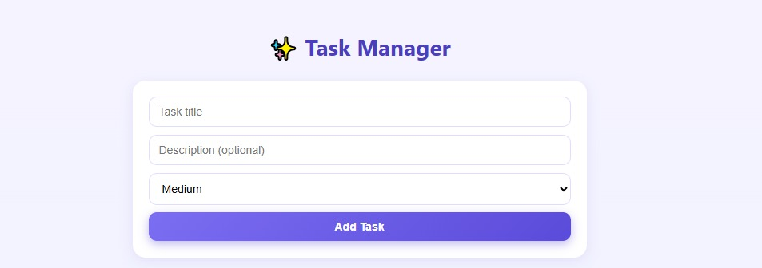
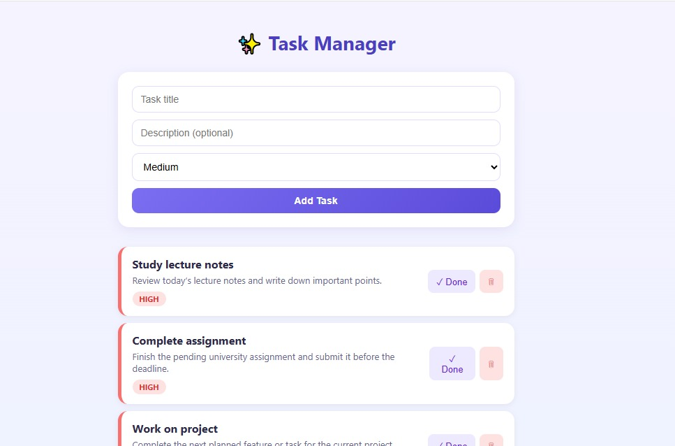
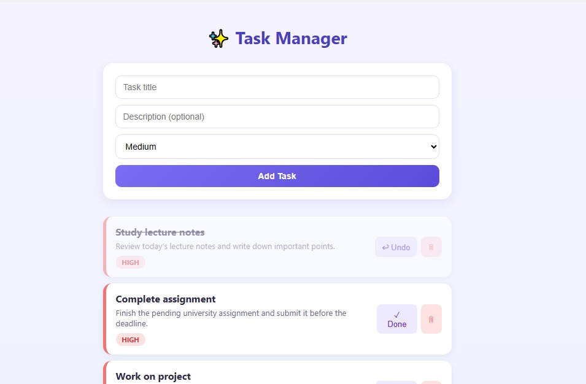

# ✨ Task Manager App

A task management web app built with React - create, complete, and delete tasks with priority levels, all saved automatically in your browser.

## 👩‍💻 Author

L.L. Piyumi Hansani

Undergraduate - BSc (Hons) Computer Science

## 📌 Project Overview

The Task Manager App helps users organize daily tasks with priority levels (Low, Medium, High) and completion tracking. Built as a frontend-focused project to practice React fundamentals - component architecture, state management, and browser-based persistence using localStorage.

## 📸 Screenshots

### 🏠 Main View


### 📝 Adding a Task


### ✅ Completed Task


## 🎯 Objectives

- **Add Tasks** - Create tasks with title, description, and priority
- **Track Progress** - Mark tasks as complete or undo them
- **Manage Tasks** - Delete tasks no longer needed
- **Persist Data** - Keep tasks saved across page refreshes without a backend

## ✨ Features

| Feature | Description |
|---|---|
| 📝 Add Task | Create a task with title, description, and priority |
| ✅ Complete Task | Mark tasks done, with visual strikethrough styling |
| 🗑️ Delete Task | Remove tasks permanently |
| 🎨 Priority Colors | Color-coded tags (green/amber/red) for Low/Medium/High |
| 💾 Auto-Save | Tasks persist in the browser via localStorage |

## 🛠️ Tech Stack

- **Library:** React (with Hooks - useState, useEffect)
- **Build Tool:** Vite
- **Styling:** Custom CSS
- **Persistence:** Browser localStorage (no backend/database)

## ⚙️ Setup & Installation

### Prerequisites
- Node.js (v16 or higher)
- npm

### Steps

**Clone the repository**
```bash
git clone https://github.com/your-username/task-manager-app.git
cd task-manager-app
```

**Install dependencies**
```bash
npm install
```

**Run the development server**
```bash
npm run dev
```

Open the local URL shown in your terminal (usually `http://localhost:5173`) in your browser.

## 📂 Project Structure
```
task-manager-app/
│
├── src/
│   ├── App.jsx
│   ├── App.css
│   └── components/
│       ├── TaskForm.jsx
│       ├── TaskList.jsx
│       └── TaskItem.jsx
│
├── screenshots/
│   ├── main-view.png
│   ├── add-task.png
│   ├── completed-task.png
│
│
├── public/
├── package.json
└── README.md
```
